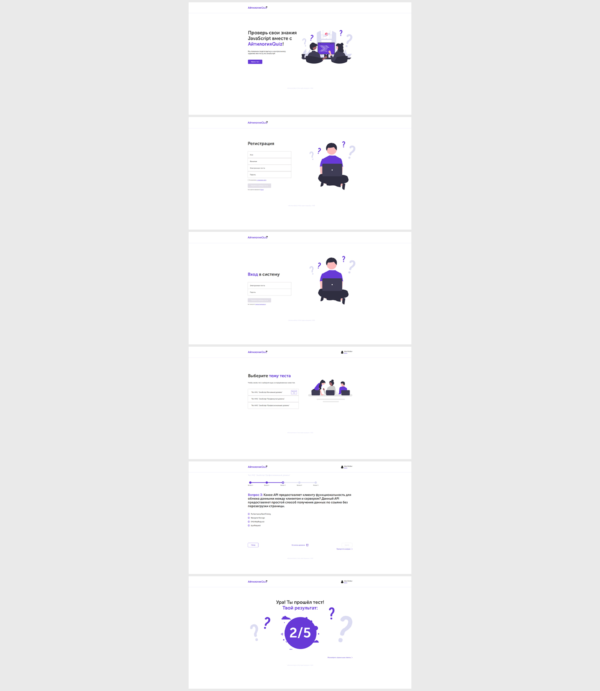

# Веб-приложение quiz-викторина (Angular)

Веб-приложение для тестирования знаний в формате quiz-викторины  
**Год:** 2022

## Внешний вид

## Реализовано:
- SPA на Angular в соответствии с техническим заданием и макетом;
- Полный функционал тестирования (регистрации/авторизации учащегося, выбор тестов, прохождение тестов, отображение результатов);
- Guards для разделения доступа к контенту для авторизованных и неавторизованных пользователей;
- Interceptor для удобства работы с jwt-токенами;
- Использование lazy-loading модулей, для оптимизации;

## Возможности:
* Регистрация, авторизация пользователя;
* Выбор теста для прохождения;
* Возможность выбрать ответ либо пропустить вопрос;
* Узнать результат тестирования после прохождения теста.

## Используемые технологии:
* Angular (HTML, SCSS, TypeScript)
* RxJS
* JWT-Авторизация
* Postman