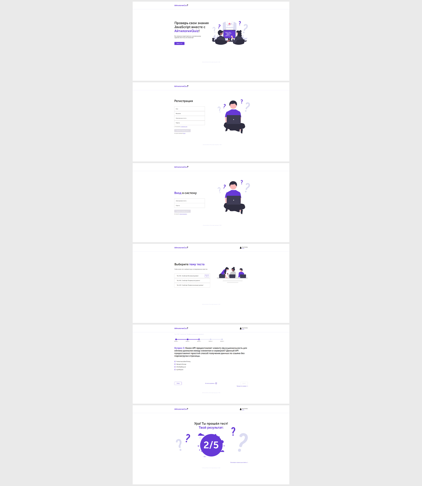

# Веб-приложение quiz-викторина (Angular)

Самостоятельно выполненный проект в рамках обучения на курсе "Профессия Frontend-Разработчик" в онлайн-школе "Айтилогия".

## Внешний вид

## Выполненные задачи:
- Реализация frontend-части SPA в соответствии с техническим заданием и макетом;
- Практика создания SPA с использованием фреймворка Angular;
- Практика использования встроенных средств Angular (разделение приложения на компоненты, модули, сервисы);
- Применение в проекте lazy loading, guards, interceptors, RxJs;
- Практика использования Postman для работы с запросами на backend.

## Возможности:
* Регистрация, авторизация пользователя;
* Выбор теста для прохождения;
* Возможность выбрать ответ либо пропустить вопрос;
* После прохождения теста пользователь узнает свой результат.

## Используемые технологии:
* Angular 16 (HTML, SCSS, TypeScript)
* RxJS
* JWT-Авторизация
* Используется заранее подготовленный backend на node.js